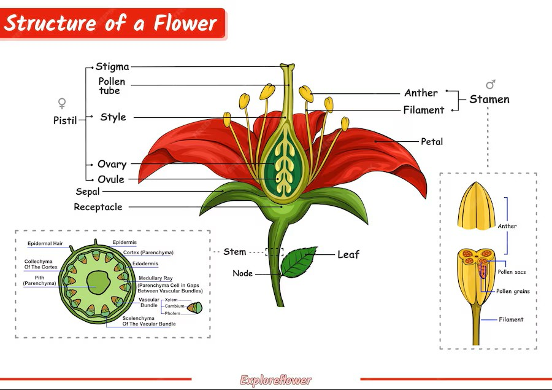

---

# 🌱 **Plant Reproduction – Year 7 Biology (GCSE Foundation Level)**

## 📘 **What You Will Learn**

* What plant reproduction is
* The differences between **sexual** and **asexual** reproduction
* The structure of a flower
* How pollination happens
* How fertilisation works
* How seeds and fruits form
* How plants disperse their seeds

---

# 🌿 **1. What Is Plant Reproduction?**

Reproduction is the process by which living things **produce new individuals** of the same species.

Plants reproduce in two main ways:

## **✔ Sexual Reproduction**

* Involves **two parent plants**
* Involves the joining of **male** and **female** gametes
* Produces **genetically different** offspring
* Uses **flowers** for reproduction

## **✔ Asexual Reproduction**

* Involves **one parent plant**
* No gametes needed
* Offspring are **genetically identical** (clones)
* Examples: runners in strawberries, tubers in potatoes

---

# 🌸 **2. Structure of a Flower**

Flowers contain male and female reproductive organs.

## **Main Parts and Their Functions**

| Part                       | Function                             |
| -------------------------- | ------------------------------------ |
| **Petals**                 | Brightly coloured to attract insects |
| **Sepals**                 | Protect the flower bud               |
| **Stamen (male)**          | Produces pollen                      |
| • Anther                   | Makes pollen grains (male gametes)   |
| • Filament                 | Holds the anther up                  |
| **Carpel/Pistil (female)** | Produces female gametes              |
| • Stigma                   | Sticky; catches pollen               |
| • Style                    | Supports the stigma                  |
| • Ovary                    | Contains ovules                      |
| • Ovule                    | Contains female gamete (egg cell)    |

---

# 🐝 **3. Pollination**

Pollination is the transfer of **pollen** from the **anther** to the **stigma**.

There are two main types:

## **✔ Insect Pollination**

* Flowers are bright and colourful
* Have nectar to attract insects
* Sticky pollen that sticks to the insect’s body
* Stigma is sticky to catch pollen

## **✔ Wind Pollination**

* Flowers are small and dull
* Produce lots of lightweight pollen
* Long, feathery stigmas to catch pollen
* No nectar (doesn’t need insects)

---

# 🌼 **4. Fertilisation**

After pollination:

1. A pollen grain lands on the stigma
2. It grows a **pollen tube** down the style
3. The tube enters the ovary
4. The male gamete travels down the tube
5. It fuses with the ovule (egg cell)

This joining of male and female gametes is called **fertilisation**.

Result:

* A **seed** forms from the **fertilised ovule**
* The **ovary** becomes a **fruit**

---

# 🌱 **5. Seed and Fruit Formation**

## **Seeds contain:**

* The **embryo** (baby plant)
* **Food store** (to help early growth)
* **Seed coat** (protects the seed)

## **Fruits:**

* Help with protecting and dispersing seeds

Examples:

* Apple = fruit
* Sunflower seeds = seeds in a dry fruit
* Peas = seeds inside pods

---

# 🍃 **6. Seed Dispersal**

Plants spread their seeds away from the parent plant to avoid overcrowding.

## **Types of Seed Dispersal**

### **✔ Wind Dispersal**

* Seeds are light
* May have wings or fluffy parachutes
* Example: dandelion, sycamore

### **✔ Animal Dispersal**

* Animals eat the fruit and drop seeds
* Seeds may stick to fur
* Example: blackberries, burdock

### **✔ Water Dispersal**

* Seeds float
* Example: coconut

### **✔ Explosion Dispersal**

* Pods burst open and throw seeds out
* Example: peas, gorse

---

# 🌿 **7. Germination**

Germination is when a seed starts to grow into a new plant.

## **Seeds need:**

* **Water** (to activate enzymes)
* **Oxygen** (for respiration)
* **Warmth** (for enzyme activity)

Light is **not always needed**.

---

# 📝 **8. Summary**

* Plants can reproduce sexually (through flowers) and asexually
* Flowers contain male and female parts
* Pollination transfers pollen to stigma
* Fertilisation creates seeds inside fruits
* Seeds must be dispersed to grow successfully
* Germination is the first stage of plant growth

---

# 🧠 **9. Quick Check Questions**

1. What is the function of the anther?
2. How do wind-pollinated flowers differ from insect-pollinated flowers?
3. What happens during fertilisation?
4. Why is seed dispersal important?
5. Name three conditions needed for germination.

---

